# DBS302 NoSQL Database Management
## Practical 1 - Laboratory Report

## 1. Introduction

This practical sets up three NoSQL databases — **Redis**, **MongoDB**, and **Cassandra** — using Docker, implements a social media data model in each, and contrasts their query patterns and performance.

| Database | Type | Strength |
|----------|------|----------|
| Redis | Key-Value Store | In-memory speed, caching |
| MongoDB | Document Store | Flexible schema, rich queries |
| Cassandra | Column-Family Store | Write-heavy, linear scalability |

---

## 2. Setup Evidence

Docker Desktop was installed and all three containers were started using `docker compose up -d`.

**Docker version confirmed:**

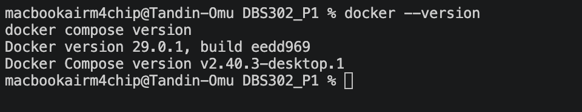

**All three containers running:**

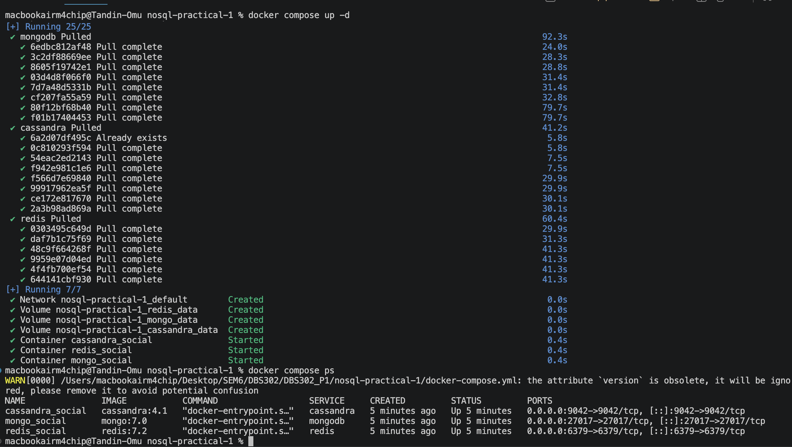

---

## 3. Implementation

### Part A - Redis

**3.1 Connection verified:**

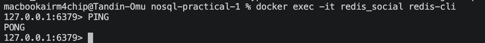

**3.2 User profiles created using HSET, retrieved with HGETALL:**

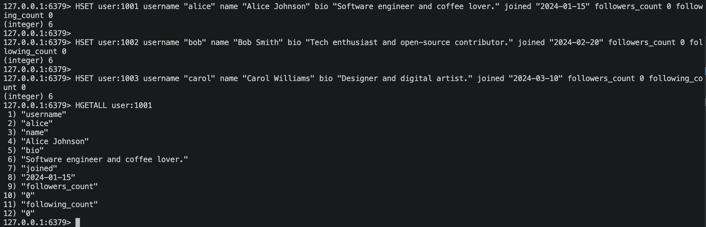

**Key commands:**
```
HSET user:1001 username "alice" name "Alice Johnson" ...
HGETALL user:1001
```

**3.3 Follower relationships modelled using Sets:**

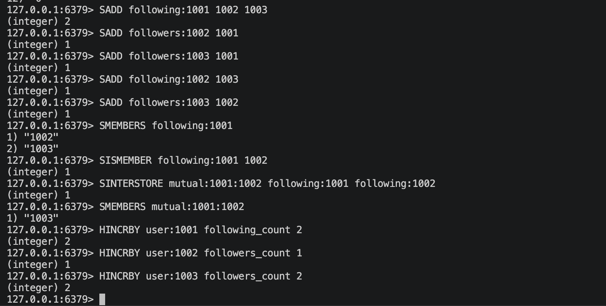


**3.4 Posts and timeline using Lists:**

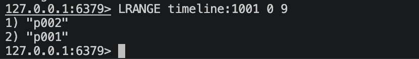


**3.5 News feed using Sorted Set and like counter:**

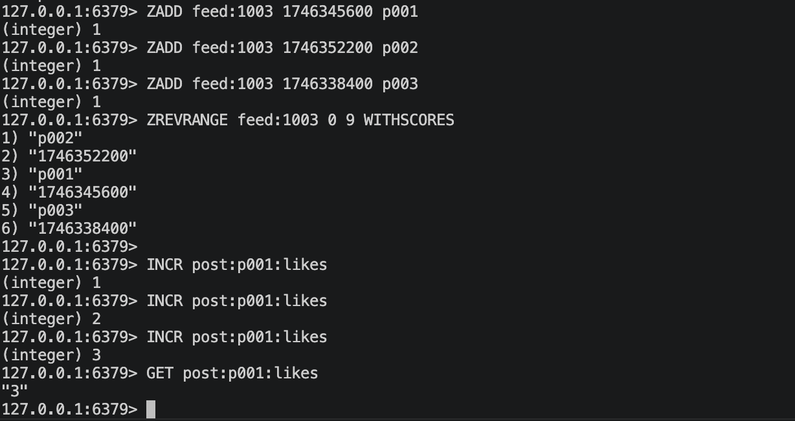

```
ZADD feed:1003 1746345600 p001
ZREVRANGE feed:1003 0 9 WITHSCORES
INCR post:p001:likes
GET post:p001:likes
```

---

### Part B - MongoDB

**3.6 Connection established:**


**3.7 Users inserted using insertMany:**

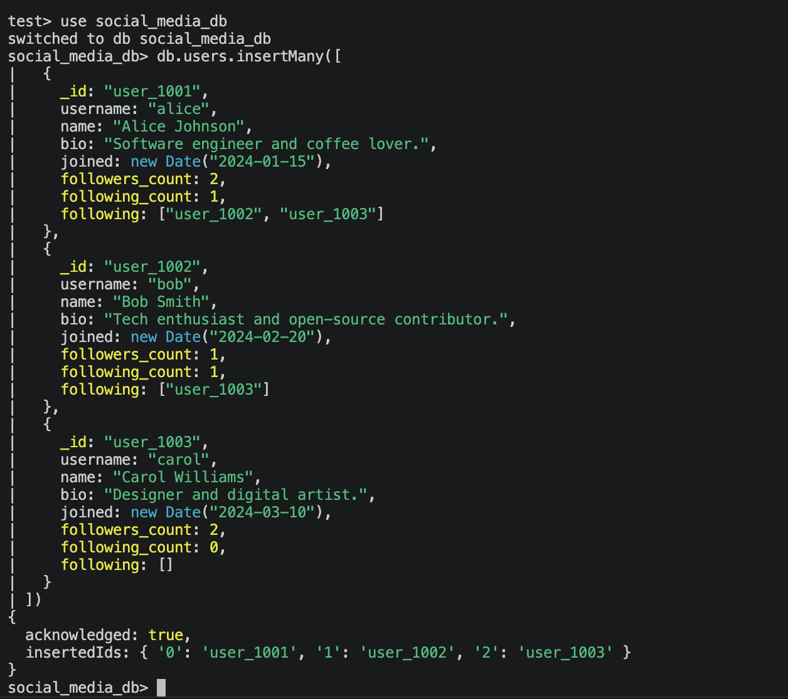

**3.8 Posts inserted and read queries executed:**

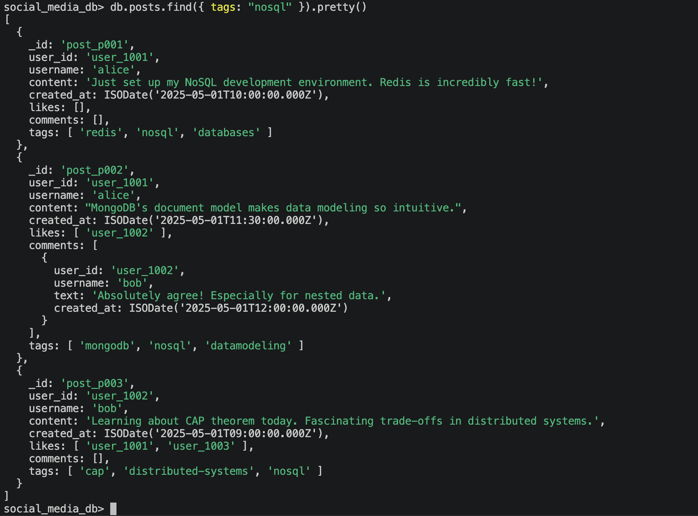

```js
db.posts.find({ user_id: "user_1001" }).pretty()
db.posts.find({ tags: "nosql" }).pretty()
```

**3.9 Update operations — adding likes and comments:**

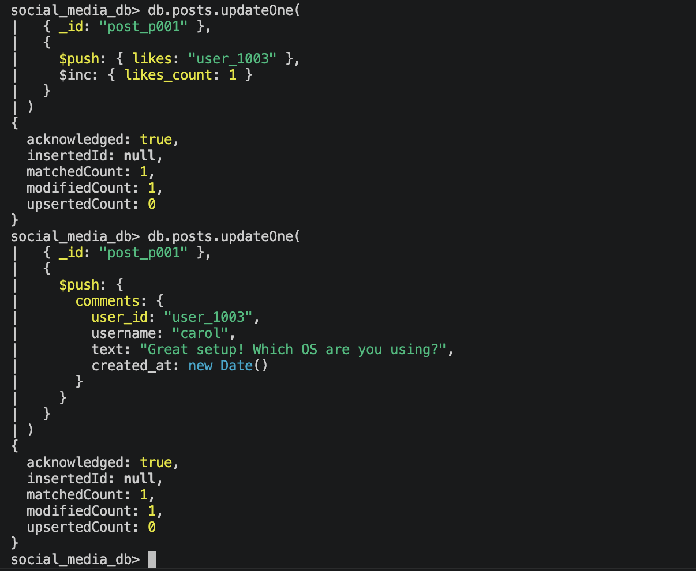


**3.10 Aggregation pipeline — building Alice's news feed:**

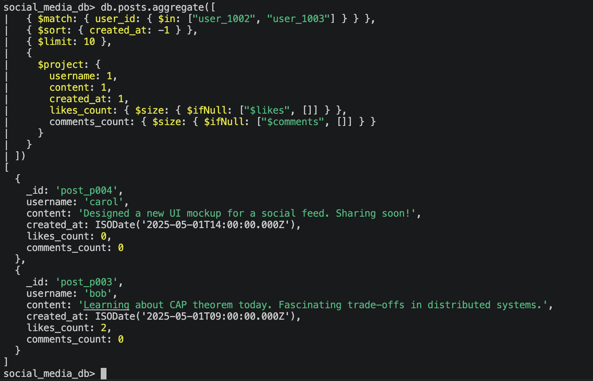


**3.11 Indexes created and query plan verified:**

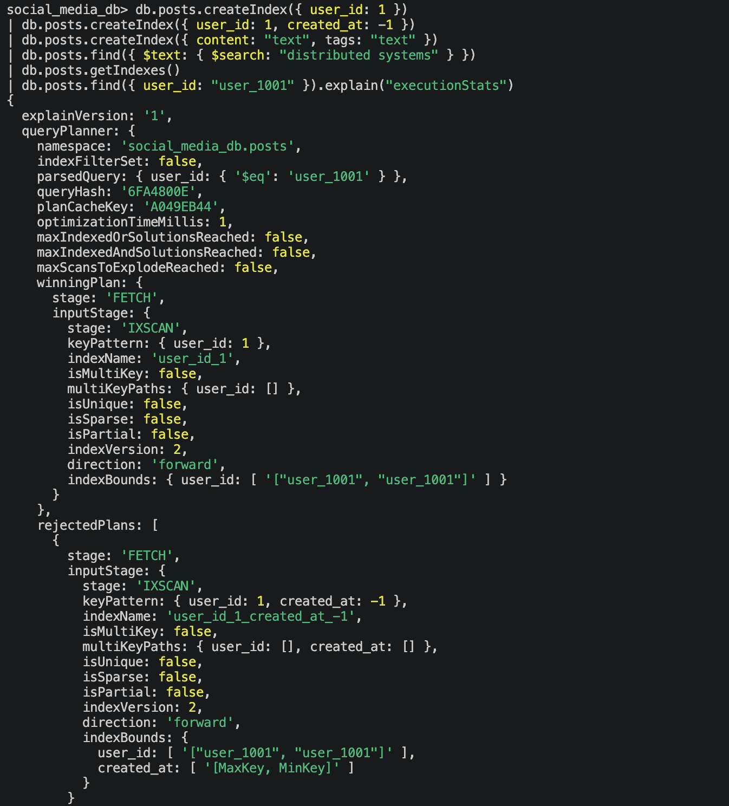

```js
db.posts.createIndex({ user_id: 1 })
db.posts.createIndex({ user_id: 1, created_at: -1 })
db.posts.createIndex({ content: "text", tags: "text" })
db.posts.find({ user_id: "user_1001" }).explain("executionStats")
// Result: stage: 'IXSCAN' — confirms index is used
```

---

### Part C — Cassandra

**3.12 Connection and cluster verified:**

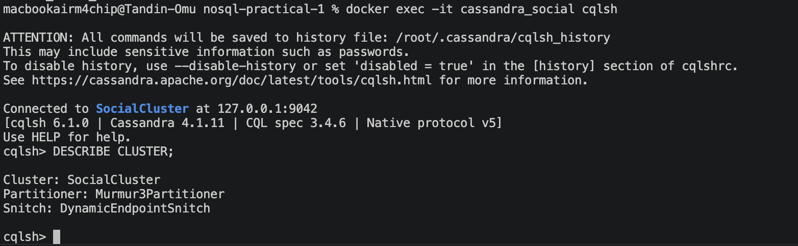

**3.13 Users table created and populated:**

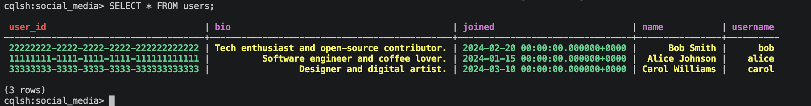


**3.14 Posts by user table — reverse chronological order confirmed:**

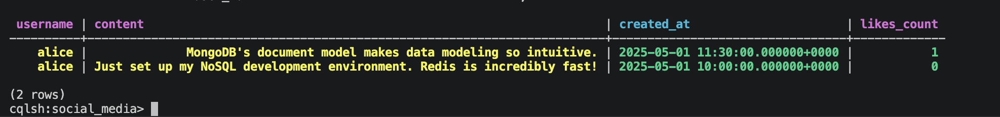

```sql
CREATE TABLE posts_by_user (
  user_id UUID, created_at TIMESTAMP, post_id UUID, ...
  PRIMARY KEY (user_id, created_at, post_id)
) WITH CLUSTERING ORDER BY (created_at DESC, post_id ASC);

SELECT username, content, created_at FROM posts_by_user
WHERE user_id = 11111111-1111-1111-1111-111111111111;
```

**3.15 Followers table:**

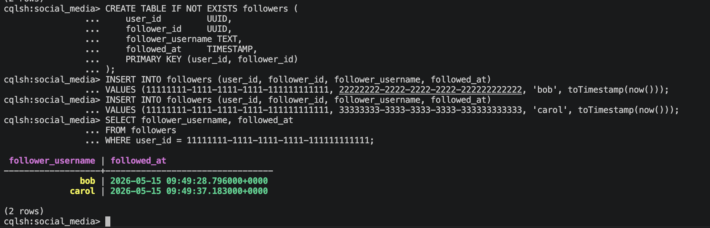

**3.16 Timeline (fan-out-on-write) — Bob's feed:**

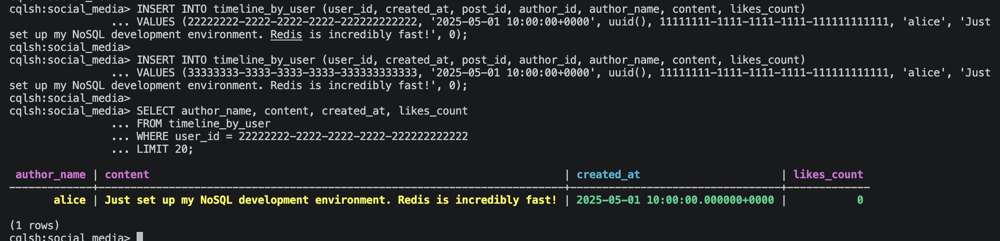

**3.17 Query tracing and invalid query error:**

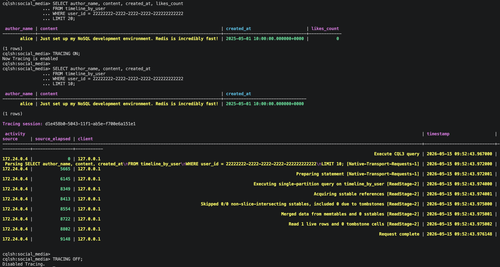

Tracing showed per-node execution in microseconds. Querying by a non-primary-key column (`username`) produced an error:

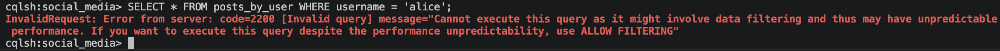

```
InvalidRequest: Cannot execute this query as it might involve data filtering
and thus may have unpredictable performance. Use ALLOW FILTERING.
```

This confirms Cassandra's core constraint: **queries must be designed around partition keys**.

---

## 4. Benchmark Results

The Python benchmark script was run inside the Cassandra container with 500 write and read operations per database.

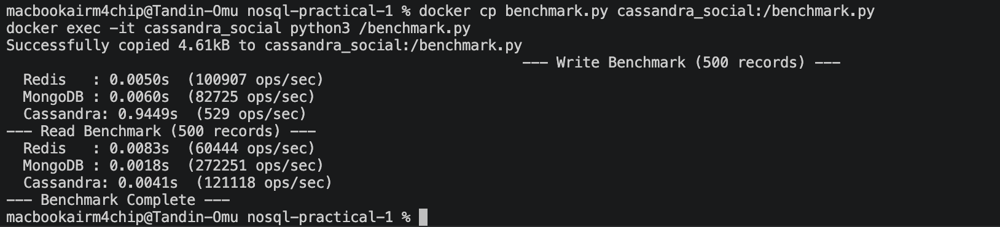

**Results:**

| Operation | Redis | MongoDB | Cassandra |
|-----------|-------|---------|-----------|
| Write (ops/sec) | 100,907 | 82,725 | 529 |
| Read (ops/sec) | 60,444 | 272,251 | 121,118 |

**Interpretation:**
- **Redis** had the fastest writes due to in-memory operation.
- **MongoDB** had the fastest reads because of indexed single-query retrieval.
- **Cassandra** had the lowest single-node write throughput, but this scales linearly with additional nodes in a real cluster — making it the strongest choice at scale.
- Cassandra's read speed was strong, confirming its efficient partition-key-based lookups.

---

## 5. Exercises

### Exercise 1 — Redis: Trending Hashtags

A Sorted Set was used where the score represents post count per hashtag. Top 3 retrieved using `ZREVRANGE`.

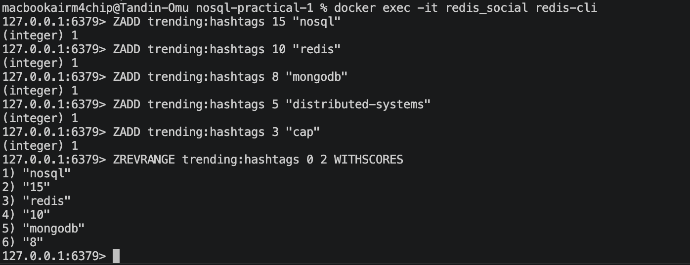

```
ZREVRANGE trending:hashtags 0 2 WITHSCORES
→ nosql(15), redis(10), mongodb(8)
```


### Exercise 2 — MongoDB: Top 5 Most Liked Posts

An aggregation pipeline used `$addFields`, `$sort`, `$limit`, `$lookup`, and `$project` to return the most liked posts with author information.

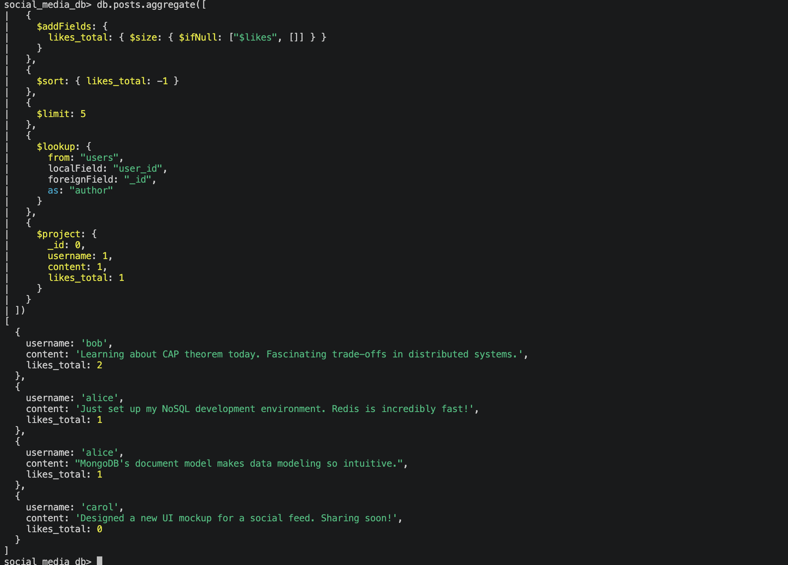

Result: Bob's CAP theorem post was the most liked (2 likes).


### Exercise 3 - Cassandra: Posts by Tag

A dedicated `posts_by_tag` table was created with `tag` as the partition key and `created_at DESC` as the clustering column, enabling efficient tag-based retrieval without `ALLOW FILTERING`.

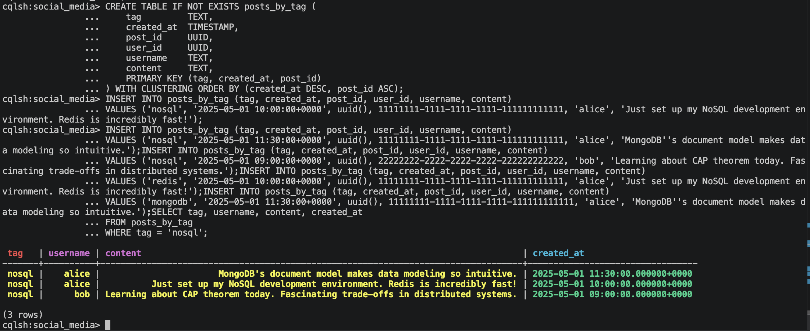

```sql
CREATE TABLE posts_by_tag (
  tag TEXT, created_at TIMESTAMP, post_id UUID, ...
  PRIMARY KEY (tag, created_at, post_id)
) WITH CLUSTERING ORDER BY (created_at DESC, post_id ASC);

SELECT tag, username, content, created_at FROM posts_by_tag
WHERE tag = 'nosql';
→ 3 rows returned in reverse chronological order
```

---

### Exercise 4 — Comparison: Username Change

**Redis:**

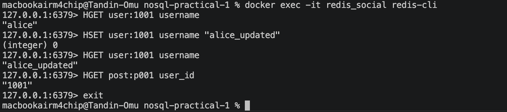

Only 1 update needed — `HSET user:1001 username "alice_updated"`. Posts reference users by ID, not by username, so no post updates required.

**MongoDB:**

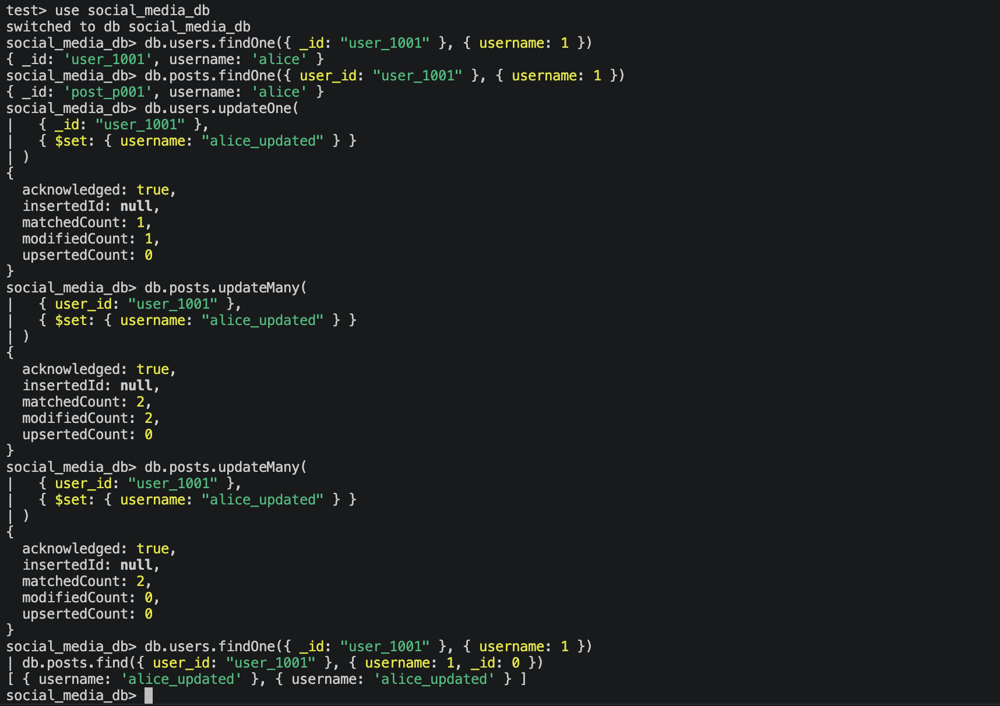

2 operations needed — `updateOne` on users + `updateMany` on posts (2 posts modified), because username is embedded in post documents.

**Cassandra:**

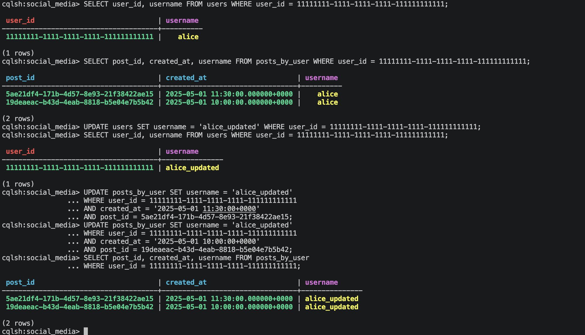

Multiple `UPDATE` statements needed — one on `users` table + one per post row in `posts_by_user`, because username is denormalized across tables.

**Comparison Table:**

| Aspect | Redis | MongoDB | Cassandra |
|--------|-------|---------|-----------|
| Updates required | 1 (user hash only) | 2 (users + posts collection) | 3+ (users + each post row) |
| Consistency risk | Low | Medium | High |
| Reason | No username in post keys | Username embedded in documents | Username duplicated across tables |
| Lesson | ID-based references avoid duplication | Embedding causes write amplification | Denormalization is costly on updates |

---

## 6. Comparison Table

| Aspect | Redis | MongoDB | Cassandra |
|--------|-------|---------|-----------|
| Data model | Key-Value (Hash, List, Set, ZSet) | BSON Documents | Partitioned rows with clustering |
| Schema | None | Optional validation | Strict DDL required |
| Query flexibility | Very limited | Excellent (ad-hoc) | Very limited (query-driven) |
| Write speed | Extremely fast (memory) | Fast | Very fast at scale |
| Read speed | Fast (single key) | Fast (indexed) | Fast (partition scan) |
| Relationships | Manual via separate keys | Embedding or referencing | Denormalization |
| Horizontal scale | Redis Cluster | Sharding | Linear (add nodes) |
| Best for | Caching, sessions, counters | Flexible apps, analytics | High-write, large-scale feeds |

**Query comparison - "Get 10 most recent posts by a user":**

| Database | Query |
|----------|-------|
| Redis | `LRANGE timeline:1001 0 9` + pipeline of HGETALL |
| MongoDB | `db.posts.find({ user_id: "user_1001" }).sort({ created_at: -1 }).limit(10)` |
| Cassandra | `SELECT * FROM posts_by_user WHERE user_id = ... LIMIT 10` |

---

## 7. Summary Analysis

This practical demonstrated that NoSQL databases are not interchangeable — each is purpose-built for a specific class of problems. Redis excels at speed through in-memory storage, making it ideal for caching, session management, and real-time counters, but it lacks native query capability and requires developer discipline to maintain data relationships. MongoDB offers the most developer-friendly experience with its flexible document model and powerful aggregation framework, making it suitable for applications with evolving schemas and complex queries. Cassandra sacrifices query flexibility entirely in exchange for linear write scalability and fault tolerance, making it the right choice for systems that must handle millions of writes per second across distributed nodes.

For a real social media platform, the best approach would be to use **all three in combination**: Cassandra for storing high-volume timelines and posts, MongoDB for user profiles and analytics, and Redis for caching feeds, tracking trending hashtags, and managing sessions. This multi-database architecture, known as polyglot persistence, reflects how production systems like Twitter and Instagram are actually built. The key lesson from this practical is that database selection must be driven by the access patterns of the application, not by familiarity or convenience.


