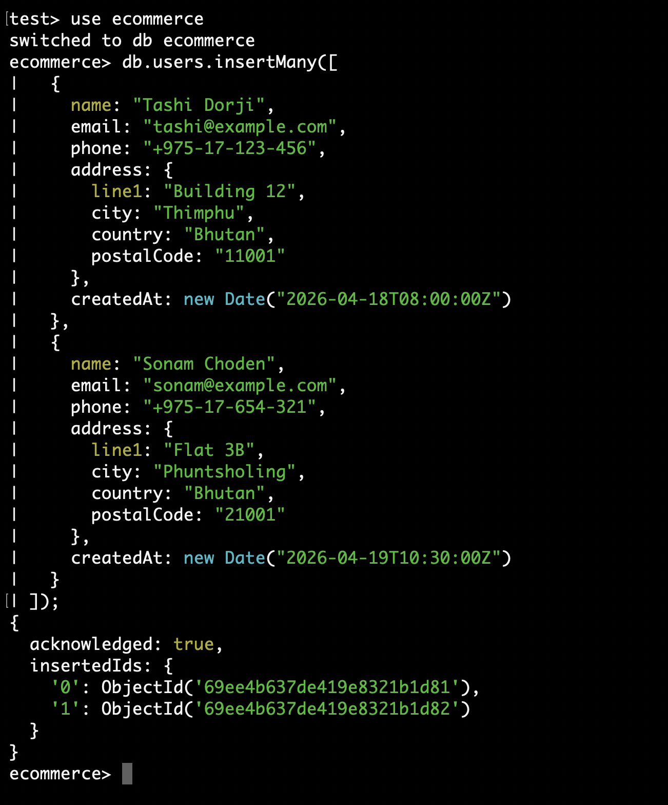
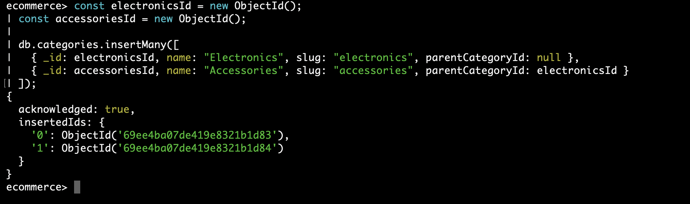
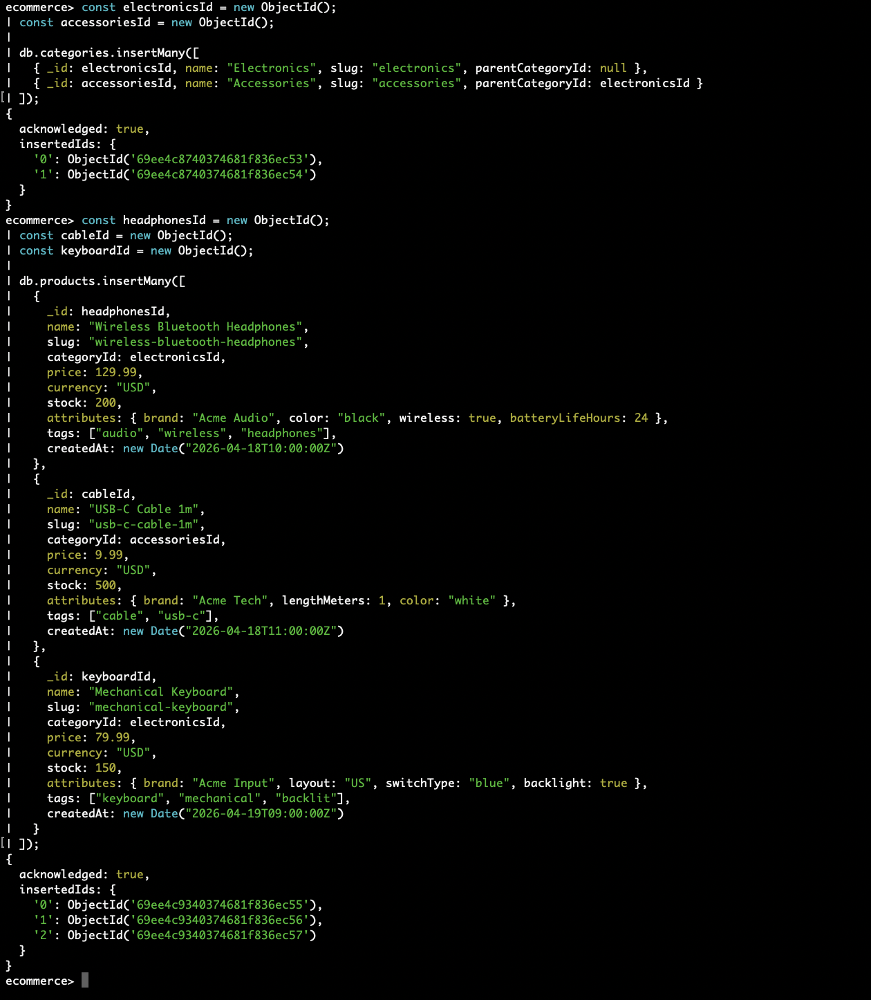
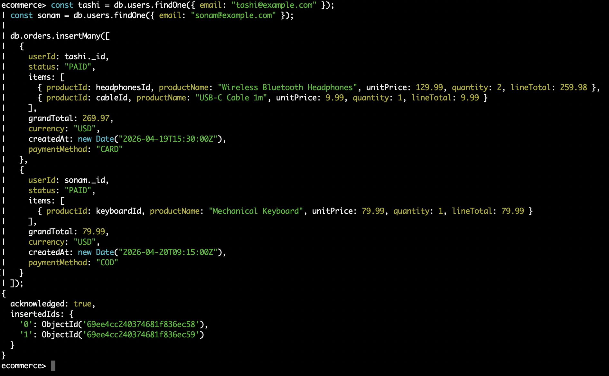
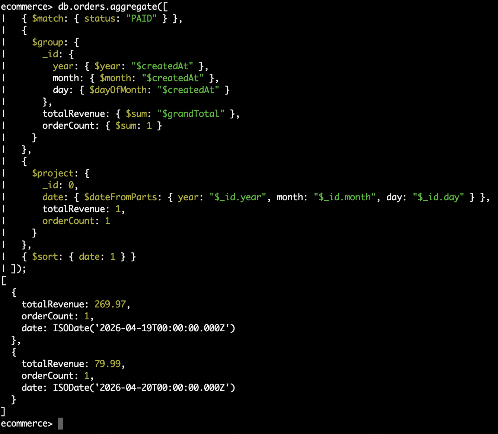
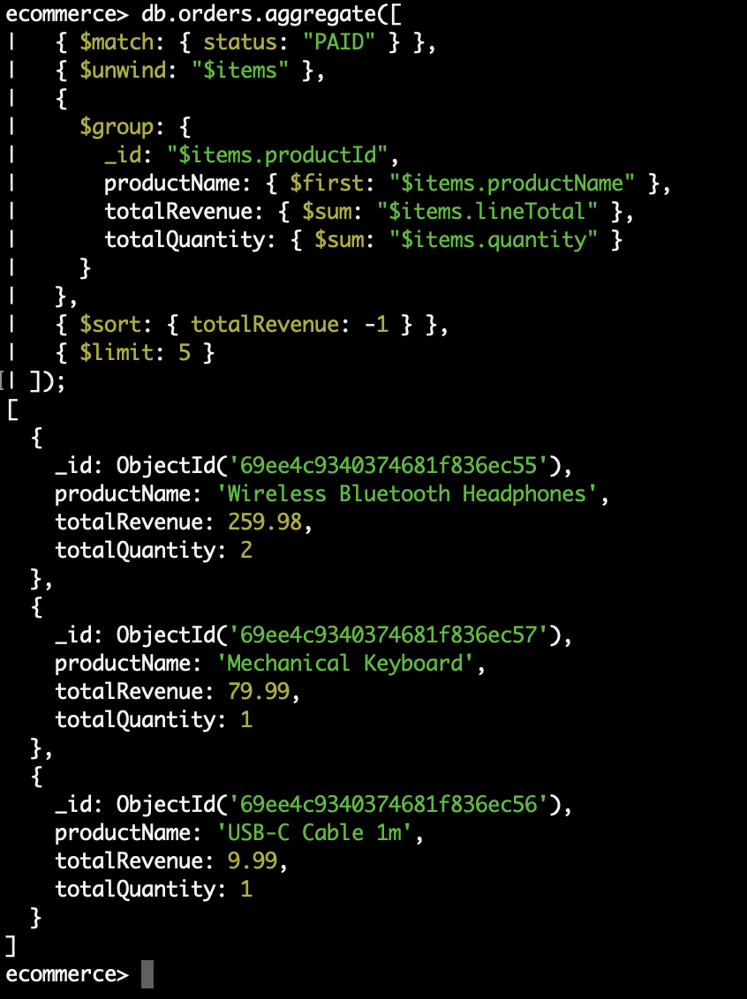
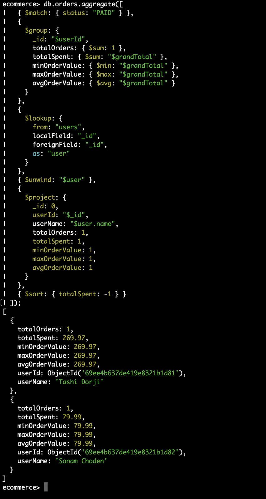
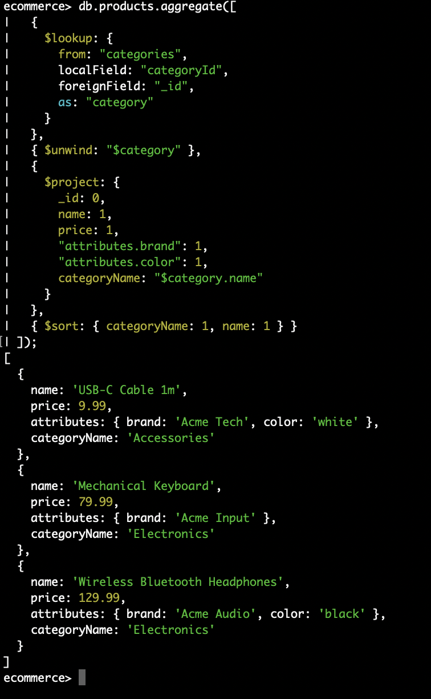
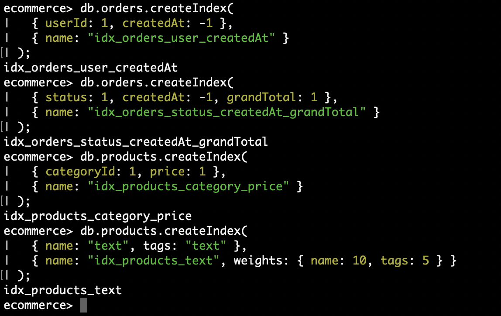
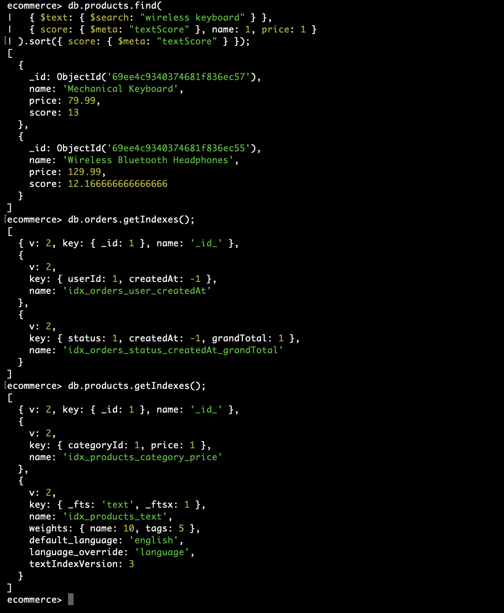

# DBS302 - Practical 3 Report
## Design and Implement an E-Commerce Platform Schema in MongoDB


## Aim

In order to create an e-commerce schema, executed queries on the data using the aggregation framework, and employ indexing and query analysis methods in MongoDB for optimizing performance.


## Objectives

By the end of this practical, the following objectives were achieved:

- Designed a practical e-commerce schema based on the document-oriented data model of MongoDB.
- Materialized the schema by creating appropriate collections within MongoDB and populating them with sample data.
- Executed non-trivial queries using MongoDB's aggregation framework for analysis.
- Created appropriate indexes to facilitate queries and write operations to the collection.
- Used the `explain()` command to diagnose slow queries and confirm optimizations made.

### MongoDB Data Modeling

MongoDB uses a flexible schema-based approach, where data that is accessed simultaneously should be stored together. In the case of an e-commerce platform, two design considerations emerge:

**Embedding vs Referencing:**
- **Embed** when related data is accessed together and bounded in size, for example, order items inside an order document.
- **Reference** when relationships are many-to-many or data grows without a clear bound — for example, a product referenced from many orders.

In this practical, order items are embedded inside orders for read efficiency. Products and users are referenced by their `ObjectId` to allow joins via `$lookup` when needed.

### Aggregation Framework

The aggregation pipeline processes documents through a sequence of stages, where the output of one stage becomes the input of the next. Key stages used in this practical:

| Stage      | Purpose                                    |
|------------|--------------------------------------------|
| `$match`   | Filters documents (like SQL WHERE)         |
| `$group`   | Groups documents and computes accumulators |
| `$project` | Reshapes output fields                     |
| `$lookup`  | Joins data from another collection         |
| `$unwind`  | Deconstructs array fields into documents   |
| `$sort`    | Orders results                             |
| `$limit`   | Restricts number of output documents       |

### Indexing and Query Optimization

Indexes allow MongoDB to avoid full collection scans (COLLSCAN) by using an index scan (IXSCAN) instead. Key index types used:

- **Compound index** - covers multiple fields; ordered using the ESR rule (Equality → Sort → Range).
- **Text index** - enables full-text search across string fields with configurable weights.
- **`explain("executionStats")`** - reveals whether a query performs a COLLSCAN (slow) or IXSCAN (fast) and shows key metrics like `totalDocsExamined` and `totalKeysExamined`.


## Schema Design

The e-commerce platform uses four collections. The schema was designed following the query-first principle — structured around the most frequent access patterns rather than normalization rules.

### Collections Overview

| Collection   | Documents | Design Choice                                      |
|--------------|-----------|----------------------------------------------------|
| `users`      | 2         | Embedded address subdocument                       |
| `categories` | 2         | Self-referencing `parentCategoryId` for hierarchy  |
| `products`   | 3         | Attribute Pattern for variable product specs       |
| `orders`     | 2         | Embedded items array for read efficiency           |

### Entity Relationship

```
users (1) - (many) orders
products (many) - (many) orders.items  [via embedded productId reference]
categories (1) - (many) products
```

Order items are **embedded** inside the orders document. Products are **referenced** by ObjectId, allowing `$lookup` joins for analytics while keeping the common read path fast.


## Implementation

### Step 1 - Environment Setup

MongoDB was installed, and the `ecommerce` database was created in mongosh.


### Step 2 - Insert Sample Data

#### 2.1 Insert Users

Two users were inserted - Tashi Dorji from Thimphu and Sonam Choden from Phuntsholing - each with an embedded address subdocument.



#### 2.2 Insert Categories

Two categories were inserted — Electronics as the parent category and Accessories as a child category referencing Electronics via `parentCategoryId`.



#### 2.3 Insert Products

Three products were inserted using the Attribute Pattern, where variable specifications such as brand, color, and battery life are stored in a flexible `attributes` subdocument rather than fixed fields.



#### 2.4 Insert Orders

Two orders were inserted with embedded item arrays. Tashi's order contains two line items totalling USD 269.97. Sonam's order contains one line item totalling USD 79.99. Key product details are duplicated into the order to preserve historical accuracy even if the product changes later.



### Step 3 - Aggregation Queries

#### Query 1 - Daily Sales Totals

Groups all PAID orders by date using `$group` with date extraction operators, then computes total revenue and order count per day, sorted chronologically.

**Result:**

| Date       | Total Revenue | Orders |
|------------|---------------|--------|
| 2026-04-19 | USD 269.97    | 1      |
| 2026-04-20 | USD 79.99     | 1      |




#### Query 2 - Top Products by Revenue

Uses `$unwind` to flatten the embedded items array, then `$group` to aggregate revenue and quantity per product, sorted by total revenue descending.

**Result:**

| Product                       | Total Revenue | Qty Sold |
|-------------------------------|---------------|----------|
| Wireless Bluetooth Headphones | USD 259.98    | 2        |
| Mechanical Keyboard           | USD 79.99     | 1        |
| USB-C Cable 1m                | USD 9.99      | 1        |




#### Query 3 - Average Order Value per User

Groups orders by `userId` to compute spending statistics, then uses `$lookup` to join with the users collection to retrieve each customer's name.

**Result:**

| User         | Orders | Total Spent | Avg Order Value |
|--------------|--------|-------------|-----------------|
| Tashi Dorji  | 1      | USD 269.97  | USD 269.97      |
| Sonam Choden | 1      | USD 79.99   | USD 79.99       |




#### Query 4 - Product Catalog with Category Name

Joins the products collection with categories using `$lookup`, then projects the product name, price, brand, color, and resolved category name.

**Result:**

| Product                       | Price      | Brand      | Category    |
|-------------------------------|------------|------------|-------------|
| USB-C Cable 1m                | USD 9.99   | Acme Tech  | Accessories |
| Mechanical Keyboard           | USD 79.99  | Acme Input | Electronics |
| Wireless Bluetooth Headphones | USD 129.99 | Acme Audio | Electronics |




### Step 4 - Indexing and Query Optimization

#### Before Index Creation

The query was run against the orders collection before any indexes were created. The `explain("executionStats")` output confirmed a full collection scan with no index keys examined.

**Key metrics (before):**

| Metric              | Value      |
|---------------------|------------|
| `winningPlan.stage` | `COLLSCAN` |
| `totalKeysExamined` | 0          |
| `totalDocsExamined` | 2          |

.png)

---

#### Indexes Created

Four indexes were created to support the identified query patterns.

**Index 1 - Orders by user and date**
Supports fetching a user's recent orders sorted by date descending.

**Index 2 - Orders by status and date (ESR rule)**
Follows Equality (`status`) → Sort (`createdAt`) → Range (`grandTotal`) ordering. Placing the equality field first allows MongoDB to narrow the candidate set immediately, and the sort field second enables in-order traversal without a blocking sort step.

**Index 3 - Products by category and price**
Supports browsing products within a category sorted by price ascending.

**Index 4 - Text search index**
Enables full-text search across product names (weight 10) and tags (weight 5), so name matches rank higher than tag matches.



#### After Index Creation

The same query was run again after creating the indexes.

**Key metrics comparison:**

| Metric              | Before     | After                                    |
|---------------------|------------|------------------------------------------|
| `winningPlan.stage` | `COLLSCAN` | `IXSCAN`                                 |
| `totalKeysExamined` | 0          | 2                                        |
| Index used          | -         | `idx_orders_status_createdAt_grandTotal` |

MongoDB now uses the compound index instead of scanning the full collection. At production scale with thousands of documents, this results in significantly lower query latency and reduced CPU usage.

.png)


#### Text Search Test

A text search for "wireless keyboard" returned both matching products ranked by relevance score. Mechanical Keyboard scored higher (13.0) because "keyboard" matched the `name` field which carries a higher weight (10) than tags (5).

**Result:**

| Product                       | Price      | Score |
|-------------------------------|------------|-------|
| Mechanical Keyboard           | USD 79.99  | 13.0  |
| Wireless Bluetooth Headphones | USD 129.99 | 12.17 |



#### Index Verification

All indexes were confirmed using `getIndexes()` on both collections.


## Key Learnings

1. Query-first design simplifies schema and improves performance (avoids joins) 
2. Embedding is for tightly related data; referencing is for shared data.
3. Attribute pattern allows flexible schemas for different product types.
4. Aggregation pipelines enable powerful analytics within MongoDB.
5. Correct index order (ESR) greatly improves query efficiency.
6. explain() verifies index usage (COLLSCAN → IXSCAN).
7. Text indexes provide relevance-based search results.

## Conclusion

The entire life cycle of schema design, implementation, and optimization on MongoDB was covered in this practical. The document structure allowed flexibility when defining product features while also allowing efficient retrieval of orders through embedding. The aggregation framework enabled analytics without having to create a dedicated data warehouse. The creation of indexes ensured that queries were executed with index scanning as opposed to scanning of entire collection, something very important for production environments. The `explain()` utility came in handy to confirm that indexes are indeed being used effectively.