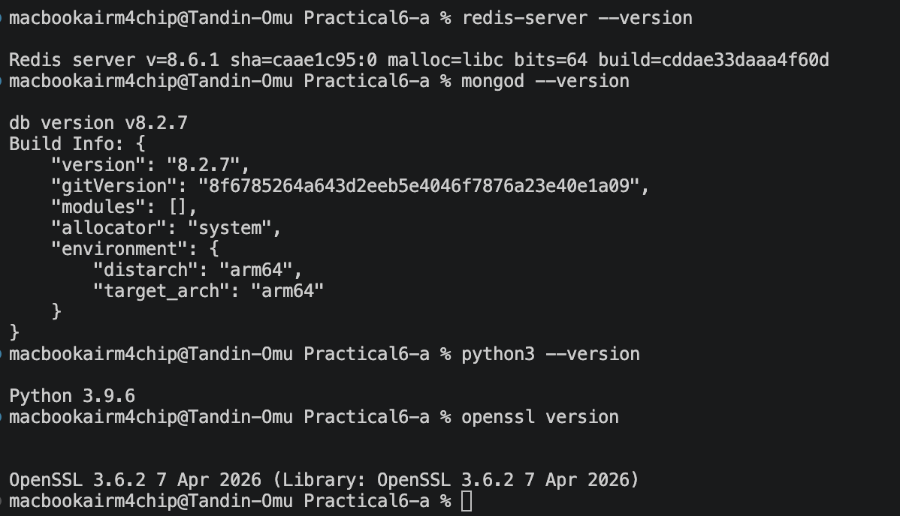
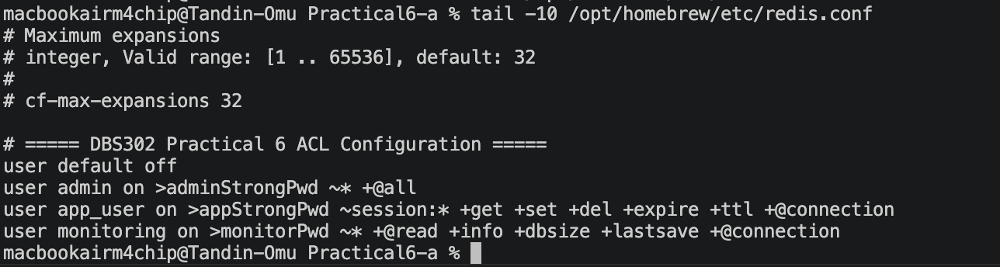
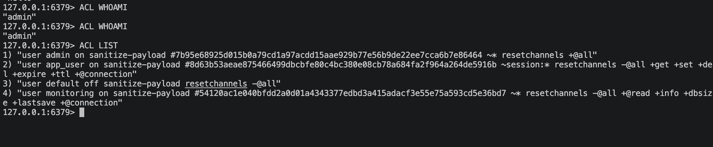
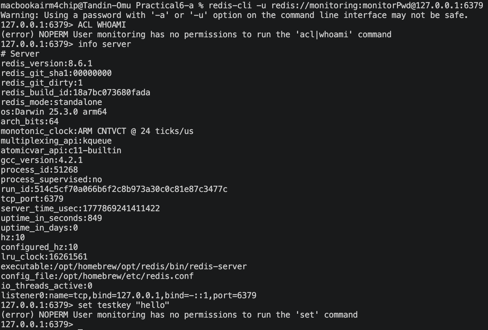
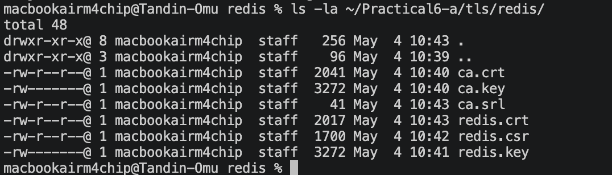
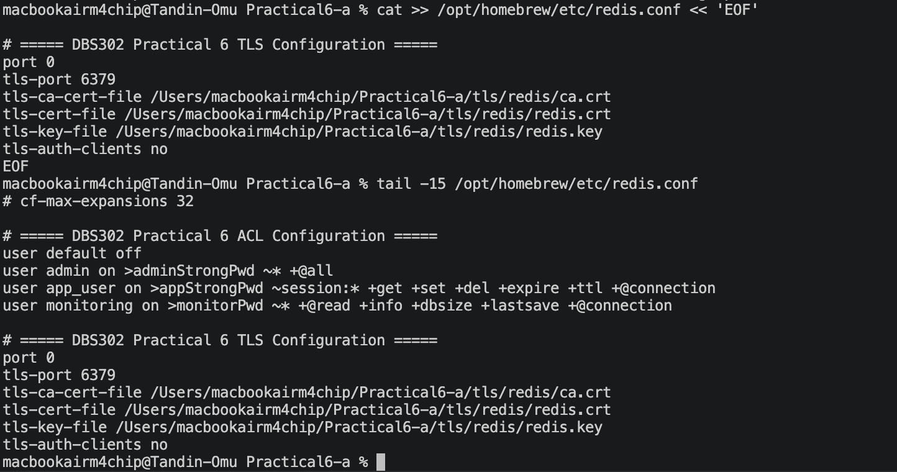
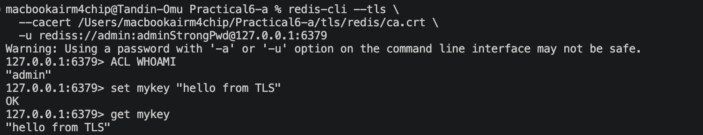
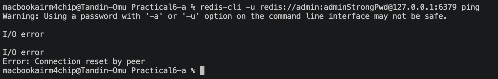
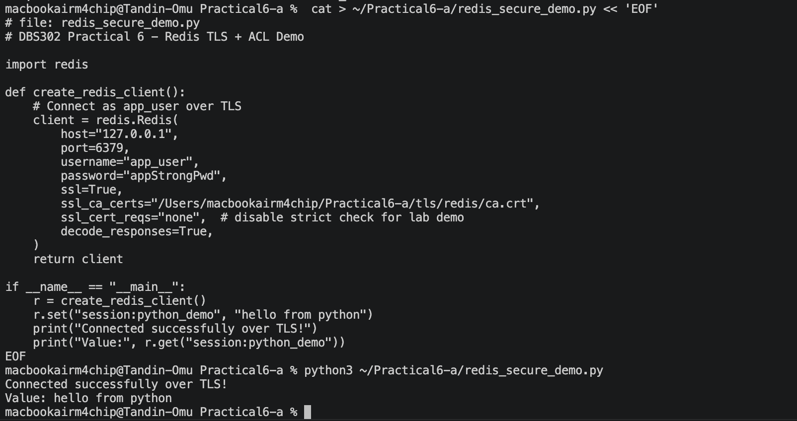

# Practical 6A : Securing Redis
## DBS302 - NoSQL Database Management  

## Aim
To secure a Redis instance using ACL-based authentication, role-based access control, and TLS encryption.

## Key Learnings
- Redis ACL allows creating users with specific passwords, key patterns, and command permissions
- Disabling the default user forces all clients to authenticate
- TLS encrypts all traffic between client and Redis server
- Applications can connect securely using credentials and TLS certificates

---

## 1. Environment Setup

| Tool | Version |
|------|---------|
| Redis | 8.6.1 |
| Python | 3.9.6 |
| OpenSSL | 3.6.2 |



---

## 2. Redis Start


---

## 3. ACL User Configuration

Added the following users to `redis.conf`:

```
user default off
user admin on >adminStrongPwd ~* +@all
user app_user on >appStrongPwd ~session:* +get +set +del +expire +ttl +@connection
user monitoring on >monitorPwd ~* +@read +info +dbsize +lastsave +@connection
```



---

## 4. ACL Test Results

### Default User Disabled


### Admin User - Full Access


### app_user - Session Keys Only

| Command | Result |
|---------|--------|
| `set session:user123 "data"` |  OK |
| `set otherkey "oops"` |  NOPERM — key not allowed |


### monitoring - Read Only

| Command | Result |
|---------|--------|
| `info server` |  OK |
| `set testkey "hello"` |  NOPERM — write not allowed |



---

## 5. TLS Configuration

### Certificates Generated

```
ca.key, ca.crt         — Certificate Authority
redis.key, redis.crt   — Redis Server Certificate
```



### redis.conf TLS Settings Added

```
port 0
tls-port 6379
tls-ca-cert-file .../ca.crt
tls-cert-file .../redis.crt
tls-key-file .../redis.key
tls-auth-clients no
```



---

## 6. TLS Test Results

| Test | Result |
|------|--------|
| TLS connection (`rediss://`) |  Connected |
| Non-TLS connection (`redis://`) |  I/O Error — Connection refused |





---

## 7. Python Application Demo

Connected to Redis as `app_user` over TLS using the `redis` Python library.

```python
redis.Redis(
    host="127.0.0.1", port=6379,
    username="app_user", password="appStrongPwd",
    ssl=True, ssl_ca_certs="ca.crt",
    decode_responses=True
)
```

**Output:**
```
Connected successfully over TLS!
Value: hello from python
```



---

## 8. Security Audit Summary

| Check | Result |
|-------|--------|
| Anonymous connection blocked |  Pass |
| app_user restricted to session keys |  Pass |
| monitoring cannot write |  Pass |
| TLS enforced, plain TCP blocked |  Pass |
| Python app connects securely |  Pass |

---

## Conclusion
Redis was successfully secured using ACL users with role-based permissions and TLS encryption. The default user was disabled to prevent anonymous access. Each user was restricted to only the commands and keys they need, demonstrating the principle of least privilege. TLS ensures all data in transit is encrypted.