# Practical 6: Securing Redis and MongoDB

## Aim

To configure and verify authentication, encryption, and role-based access control (RBAC) for Redis and MongoDB, and to perform a basic security audit of the configured databases.

## Part A - Securing Redis (Summary)

Redis was secured in three stages. First, the default user was disabled and three ACL users were created in `redis.conf` — an `admin` user with full access, an `app_user` restricted to `session:*` key patterns with limited commands, and a `monitoring` user with read-only access. Each user was tested using `redis-cli` to confirm that permissions were correctly enforced, with `app_user` being denied access to keys outside their allowed pattern.

TLS encryption was then enabled by generating self-signed certificates using `openssl` and updating `redis.conf` to use TLS on port 6379 with plain TCP disabled. A successful encrypted connection was made using `redis-cli` with the `--tls` flag, confirming both encrypted communication and ACL-based access were working together.

## Part B - Securing MongoDB

### Step 0 - Starting MongoDB Without Auth

MongoDB was already running via Homebrew. Connection was verified using `mongosh` and `show dbs`, which returned all databases freely — confirming access control was not yet enabled.

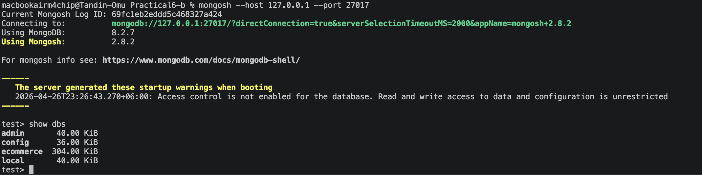

*mongosh connected and show dbs output (no auth)*

### Step 1 - Creating the Admin User

Inside `mongosh`, the database was switched to `admin` and the `rootAdmin` user was created with three roles: `userAdminAnyDatabase`, `dbAdminAnyDatabase`, and `readWriteAnyDatabase`. The command returned `{ ok: 1 }` confirming successful creation.

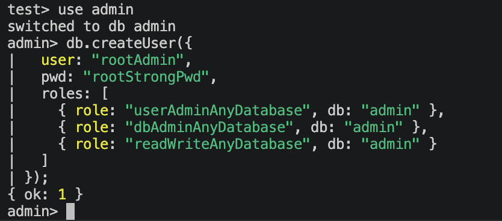

*rootAdmin user created successfully*

---

### Step 2 - Enabling Authentication

The MongoDB config file at `/opt/homebrew/etc/mongod.conf` was edited to add the `security` section with `authorization: "enabled"`. MongoDB was then restarted using `brew services restart mongodb-community`.

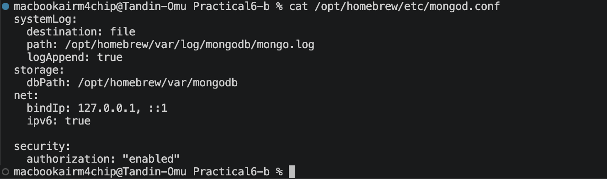

*mongod.conf showing authorization enabled*

---

### Step 3 - Testing Authentication

Two tests were performed. Connecting without credentials and running `show dbs` returned `MongoServerError[Unauthorized]`, confirming auth is enforced. Connecting as `rootAdmin` and running `db.runCommand({ connectionStatus: 1 })` returned the authenticated user and all three roles.

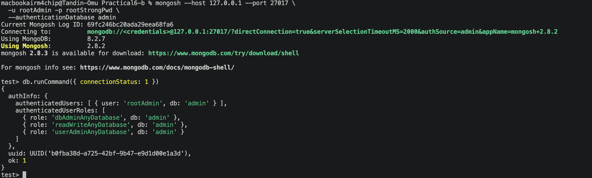

*Successful login as rootAdmin with connectionStatus output*

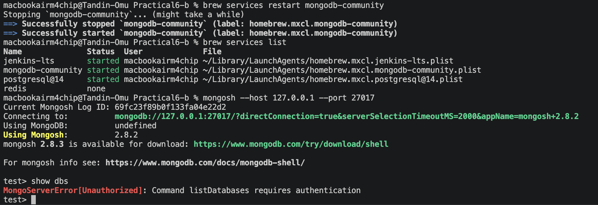

*Connection without credentials denied*

---

### Step 4 - Creating Application Role and User (RBAC)

Logged in as `rootAdmin`, a custom role called `myAppRole` was created on the `myapp` database. This role granted only `find`, `insert`, `update`, and `remove` privileges on the `myapp.customers` collection. An `appUser` was then created and assigned this role.

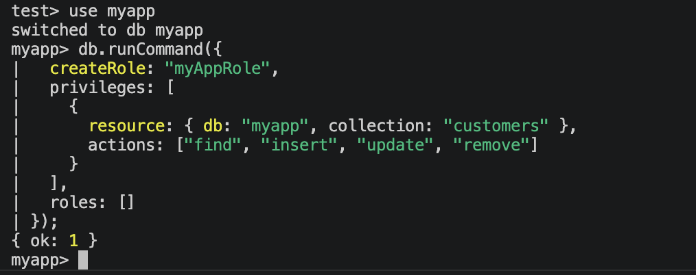

*myAppRole created successfully*

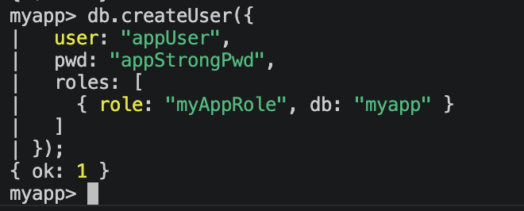

*appUser created with myAppRole*

`appUser` was then tested by logging in and running allowed and denied operations:

- `insertOne` and `find` on `myapp.customers` — both succeeded.
- Accessing `db.system.users` on the `admin` database — returned `MongoServerError[Unauthorized]`.

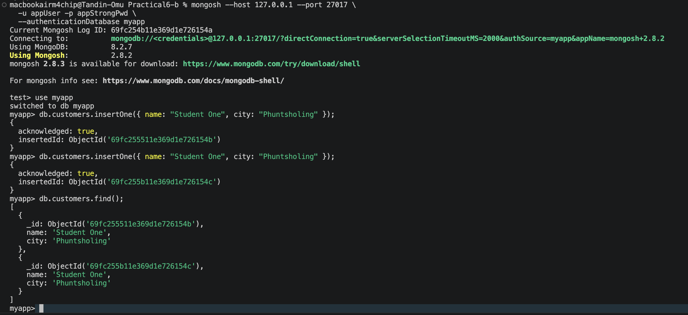

*appUser performing allowed operations on myapp.customers*

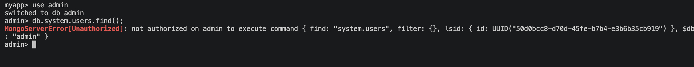

*appUser denied access to admin database*

---

### Step 5 - Enabling TLS Encryption

Self-signed certificates were generated using `openssl` and stored in `~/mongo-tls/`. The files created were: `ca.key`, `ca.pem`, `mongo.key`, `mongo.csr`, `mongo.crt`, `ca.srl`, and `mongo.pem`. The `mongod.conf` was updated with a `tls` block under `net` with `mode: requireTLS`.

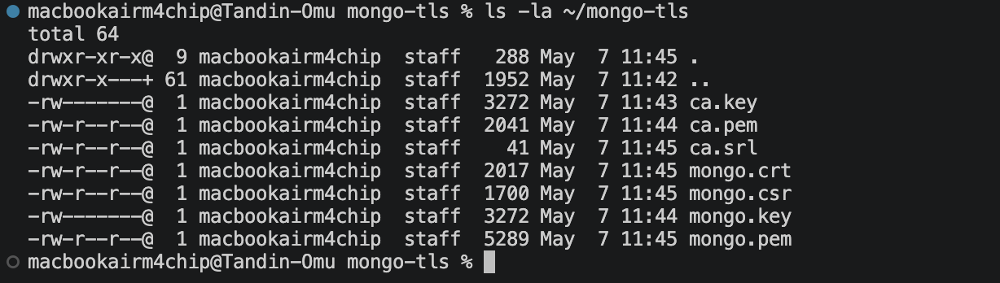

*TLS certificate files in ~/mongo-tls/*

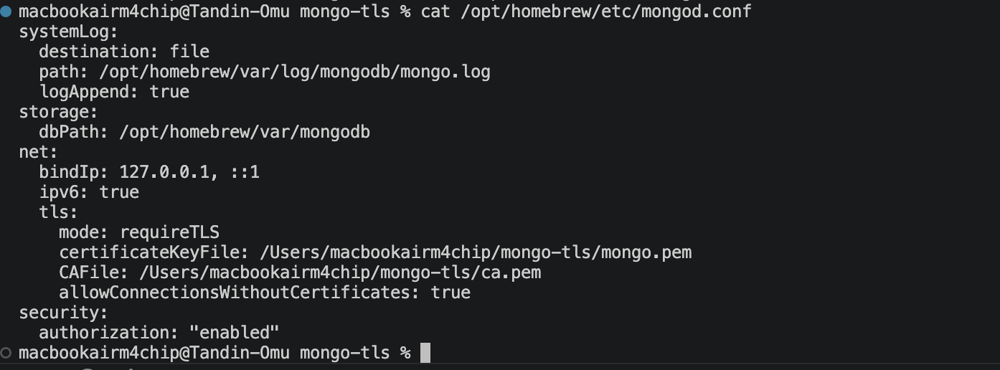

*mongod.conf showing TLS configuration*

MongoDB was restarted and two connection tests were performed:

- Without `--tls` flag: failed with `MongoServerSelectionError` — non-TLS connections are rejected.
- With `--tls`, `--tlsCAFile`, and `--tlsAllowInvalidHostnames`: connection succeeded and operations on `myapp.customers` worked correctly over an encrypted connection.

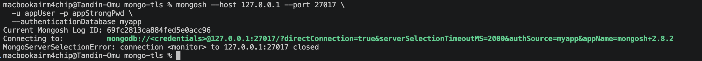

*Connection without TLS rejected*

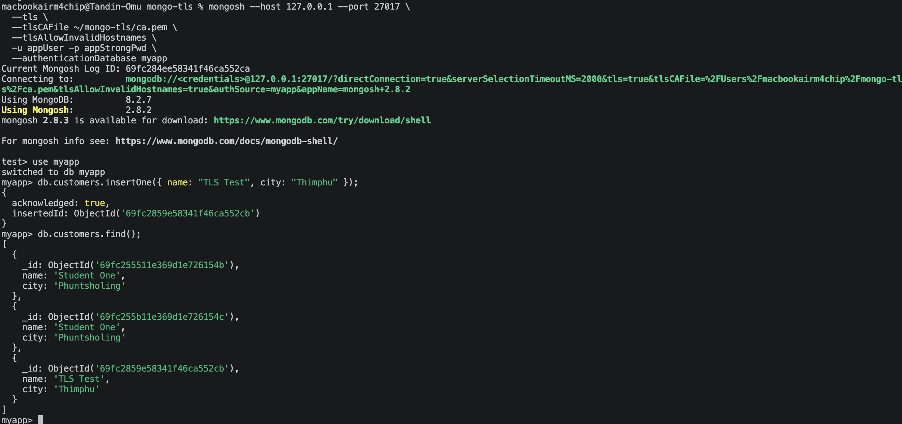

*Successful TLS connection with insert and find*

---

## Key Learning

This practical showed that securing a database requires three layers working together — authentication, role-based access control, and encryption. Removing any one of them leaves a gap: without authentication anyone can connect, without RBAC users can access data beyond their scope, and without TLS traffic can be intercepted on the network.

Testing denied operations was just as important as testing allowed ones. Confirming that `appUser` was blocked from the `admin` database and that non-TLS connections were rejected proved the security configuration was actually working, not just configured. Security is only real when you verify what is blocked, not just what is allowed.

Working on macOS also showed that while commands like `brew services restart` differ from `systemctl` on Linux, the core database concepts and `mongosh` commands are identical — these skills carry across platforms.